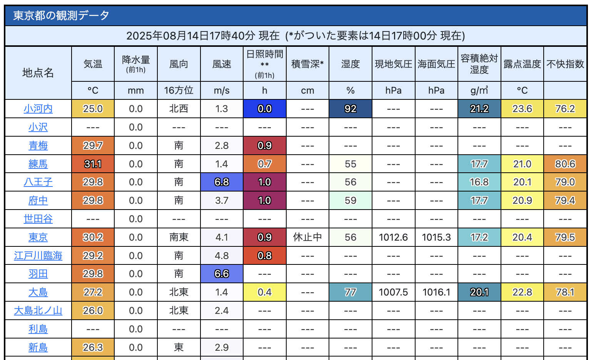

# Enhance JMA Amedas

- [気象庁のアメダスページ](https://www.jma.go.jp/bosai/amedas/)に、容積絶対湿度と露点温度を表示するユーザースクリプトです。

## インストール
1. [Tampermonkey](https://www.tampermonkey.net/), [Violentmonkey](https://violentmonkey.github.io/) などのユーザースクリプトマネージャーを利用してください。
2. このリポジトリの [dist/jma.user.js](https://github.com/kasutera/enhance_jma_amedas/raw/refs/heads/main/dist/jma.user.js) を開き、ダイアログに従ってインストールしてください。
