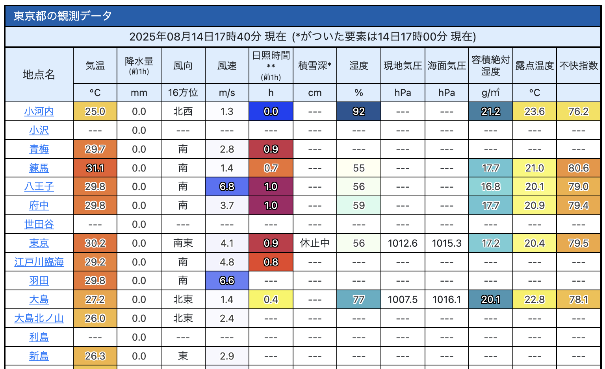
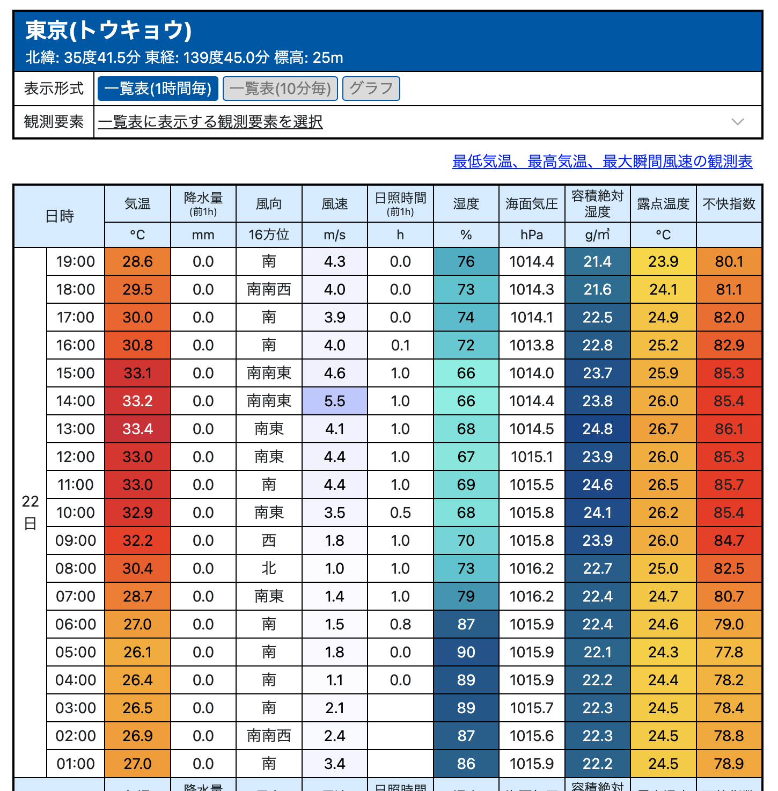

# Enhance JMA Amedas

[](https://github.com/kasutera/enhance_jma_amedas/actions/workflows/run_tests.yml)
[](https://github.com/kasutera/enhance_jma_amedas/actions/workflows/code_format.yml)
[](https://github.com/kasutera/enhance_jma_amedas/releases/latest)
[](https://nodejs.org/)
[](https://www.typescriptlang.org/)
[](https://github.com/kasutera/enhance_jma_amedas/network/updates)



- [気象庁のアメダスページ](https://www.jma.go.jp/bosai/amedas/)に、容積絶対湿度、露点温度、不快指数を表示するユーザースクリプトです。
- これらの派生要素は、観測要素選択UIから個別に表示・非表示を切り替えられます。
- JMA標準の観測要素選択は地点ごとの初期表示設定を維持し、派生要素の選択状態は独立して管理します。
- 現在の観測地点を複数お気に入り登録し、画面上部からすぐに切り替えられます。
- 上下キーで「お気に入り地点」「表示形式」「観測要素（グラフのみ）」を移動し、左右キーで項目を切り替えられます。入力欄の操作中はキー操作を横取りしません。
- グラフの派生観測要素選択と上下左右キーによる操作は、JMAサイトの日本語・英語表示の両方に対応しています。
- 地域表と時系列表は2分ごとに最新時刻を確認し、新しい観測データが表示できるときだけページ全体を自動で再読み込みします。過去日時を指定した画面は更新対象外です。

## インストール

1. [Tampermonkey](https://www.tampermonkey.net/), [Violentmonkey](https://violentmonkey.github.io/) などのユーザースクリプトマネージャーを利用してください。
2. ユーザスクリプト [jma.user.js](https://github.com/kasutera/enhance_jma_amedas/releases/latest/download/jma.user.js) を開き、ダイアログに従ってインストールしてください。

## 計算式

このユーザースクリプトでは、以下の気象学的計算を行います。

### 飽和水蒸気圧（Tetensの式）

$$e_s = 6.1078 \times 10^{\frac{7.5 \times T}{237.3 + T}}$$

- $e_s$: 飽和水蒸気圧 (hPa)
- $T$: 温度 (℃)

### 水蒸気圧

$$e = \frac{RH}{100} \times e_s$$

- $e$: 水蒸気圧 (hPa)
- $RH$: 相対湿度 (%)
- $e_s$: 飽和水蒸気圧 (hPa)

### 飽和水蒸気量

$$\rho_s = \frac{217 \times e_s}{273.15 + T}$$

- $\rho_s$: 飽和水蒸気量 (g/m³)
- $e_s$: 飽和水蒸気圧 (hPa)
- $T$: 温度 (℃)

### 容積絶対湿度

$$\rho = \frac{RH}{100} \times \rho_s$$

- $\rho$: 容積絶対湿度 (g/m³)
- $RH$: 相対湿度 (%)
- $\rho_s$: 飽和水蒸気量 (g/m³)

### 露点温度

$$T_d = \frac{237.3 \times \log_{10}\left(\frac{e}{6.1078}\right)}{7.5 - \log_{10}\left(\frac{e}{6.1078}\right)}$$

- $T_d$: 露点温度 (℃)
- $e$: 水蒸気圧 (hPa)

### 不快指数

$$DI = 0.81 \times T + 0.01 \times RH \times (0.99 \times T - 14.3) + 46.3$$

- $DI$: 不快指数
- $T$: 温度 (℃)
- $RH$: 相対湿度 (%)

## 開発

### 技術構成とローカル開発

- TypeScript（strict）と Vite + vite-plugin-monkey を使用し、UIは標準DOM APIとSVGで描画します。
- ビルド設定は `vite.config.mts`、ユーザースクリプトのメタデータは `src/jma/manifest.json` で管理します。
- Jest + jsdomによる既存の計算・DOMテストを継続します。

```bash
npm ci
npm run dev
```

開発サーバーは `http://127.0.0.1:5173/` で起動します。このURLをユーザースクリプトマネージャーのあるブラウザで開き、`[dev] Enhance JMA Amedas` をインストールしてください。本番版と開発版は同時に有効化しないでください。

開発版はローカルサーバーからモジュールを読み込みます。JMAのCSPがこの読み込みを遮断するため、開発用のブラウザプロファイルでCSPを解除できる環境が必要です。ブラウザによってはローカルネットワーク／ループバックへのアクセス許可も必要です。普段使うプロファイルの保護設定は変更しないでください。これらの条件を満たせない場合は、下記の本番ビルドを生成し、`dist/jma.user.js` をインストールして確認してください。

ソースの変更はViteの開発サーバーから配信されます。DOMに対する副作用の再初期化を確実にするため、変更後はJMAページを再読み込みしてください。開発版にはリリース用の更新URLを付与しません。

```bash
# 本番形式の単一ファイルを生成（VERSIONは必須）
VERSION=20261011 npm run build

# 型チェック、静的チェック、既存テスト
npm run typecheck
npm run ci
npm test
```

出力は `dist/jma.user.js` です。外部CDNや開発サーバーを必要としないIIFE形式で、既存の配布URLと `@grant none` を維持します。`npm run build` は型チェック後に出力ディレクトリを更新します。開発サーバー起動時はVERSIONの指定は不要です。

### アーキテクチャの境界

| 層 | 主なファイル | 責務 |
| --- | --- | --- |
| 純粋計算 | `math.ts`、`color_scale/color_scale_calculator.ts` | 気象計算と公式カラースケールの補間。HTTP・DOMに依存しません。 |
| 観測モデル | `observation.ts` | 観測所ID、実時刻の`Date`、気温・湿度・気圧、品質情報、単位を共有します。欠測値は`undefined`で保持します。 |
| JMAアダプター | `integration/` | HTTP/JSONの検証・変換、URL、画面判定、DOMセレクター、JSTの観測時刻解析、表の描画を集約します。 |
| 機能 | 各機能の`*_main.ts`、`auto_refresh.ts`、`enhanced_observation_selector.ts` | アダプターと共有モデルを使い、派生列・SVGグラフ・操作UI・自動更新を提供します。 |
| ライフサイクル | `application.ts`、`feature.ts` | 各機能を`refresh()` / `dispose()`で管理し、画面遷移とDOM再生成への追従・解除を統一します。 |

`application.ts`だけがDOM監視と`hashchange` / `popstate`の監視を所有します。更新をマイクロタスクでまとめ、機能ごとの独立したDOM監視は行いません。解除時には機能のイベント、タイマー、追加した操作UIも取り除きます。

表・グラフは通信完了時に現在のルートと対象DOMを確認します。地点変更、表の交換、機能解除前に開始した通信の古い結果を、新しい画面へ反映しません。地域表は見出しの観測時刻、時系列表・グラフは過去日時または最新公開時刻を基準にし、実行環境のタイムゾーンに依存しないJSTの実時刻でデータを取得します。

### 計算処理

- [`src/jma/math.ts`](src/jma/math.ts) の純粋関数で、気温と相対湿度から派生値を計算します。これらの計算に気圧は使用しません。
- 表では `calculateDerivedObservations` で3指標の中間値を共有し、グラフでは選択した指標の計算関数だけを呼び出します。
- [`src/jma/derived_observations.ts`](src/jma/derived_observations.ts) で、派生要素の名称・単位・列クラスと、表・グラフの欠損判定を共有します。地域表は地点行順、時系列表は時刻行順を維持し、表では小数1桁と欠損表示 `---`、グラフでは数値と欠損値 `null` を返します。
- 配色の計算は [`color_scale_calculator.ts`](src/jma/color_scale/color_scale_calculator.ts) の純粋関数、DOMへの適用は `ColorScaleManager` が担当します。公式配色と補間方法は変更しません。

### リリース方法

本プロジェクトは自動リリース機能を使用しています。以下のコマンドでリリースを作成できます：

```bash
# 本日の日付でリリースを作成
npm run release
```

このコマンドにより：

1. 今日の日付（YYYYMMDD形式）でGitタグが作成されます
2. GitHub Actionsが jma.user.js ファイルを自動ビルドします
3. GitHub Releaseが自動作成され、ユーザーがダウンロード可能になります

**注意**: VERSION環境変数が設定されていない場合、ビルドはエラーで停止します。

詳細な仕組みについては [`docs/autorelease.md`](docs/autorelease.md) をご覧ください。

### pre-commit フック

- [lefthook](https://github.com/evilmartians/lefthook) をインストールします。

```bash
npm install lefthook --save-dev
npx lefthook install
```
