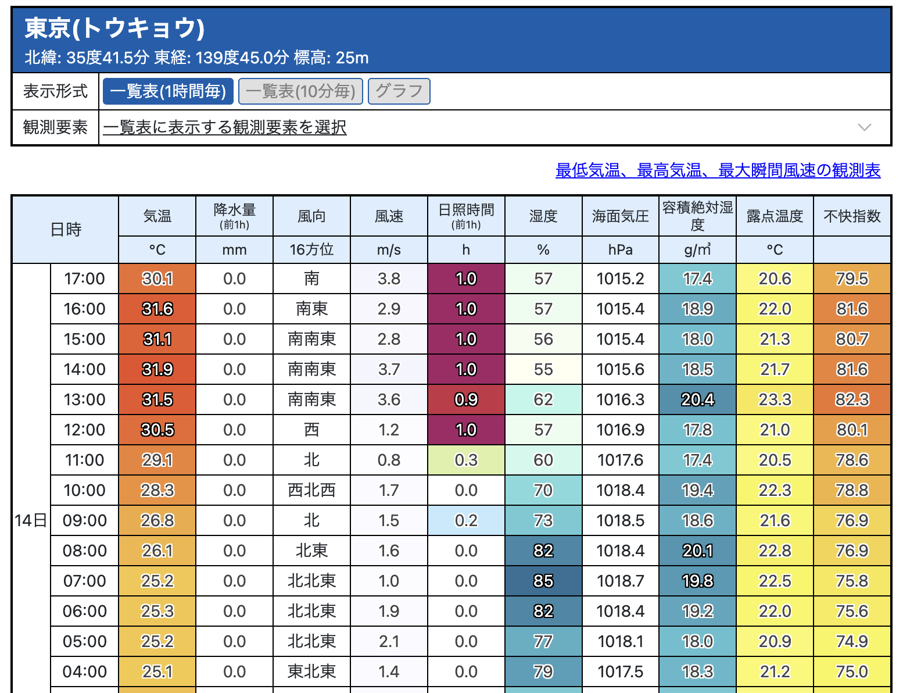

# Enhance JMA Amedas

[](https://github.com/kasutera/enhance_jma_amedas/actions/workflows/run_tests.yml)



- [気象庁のアメダスページ](https://www.jma.go.jp/bosai/amedas/)に、容積絶対湿度と露点温度を表示するユーザースクリプトです。

## インストール

1. [Tampermonkey](https://www.tampermonkey.net/), [Violentmonkey](https://violentmonkey.github.io/) などのユーザースクリプトマネージャーを利用してください。
2. このリポジトリの [dist/jma.user.js](https://github.com/kasutera/enhance_jma_amedas/raw/refs/heads/main/dist/jma.user.js) を開き、ダイアログに従ってインストールしてください。

## 計算式

このユーザースクリプトでは、以下の気象学的計算を行います。

### 飽和水蒸気圧（Tetensの式）

$$e_s = 6.1078 \times 10^{\frac{7.5 \times T}{237.3 + T}}$$

- $e_s$: 飽和水蒸気圧 (hPa)
- $T$: 温度 (℃)

### 水蒸気圧

$$e = \frac{RH}{100} \times e_s$$

- $e$: 水蒸気圧 (hPa)
- $RH$: 相対湿度 (%)
- $e_s$: 飽和水蒸気圧 (hPa)

### 飽和水蒸気量

$$\rho_s = \frac{217 \times e_s}{273.15 + T}$$

- $\rho_s$: 飽和水蒸気量 (g/m³)
- $e_s$: 飽和水蒸気圧 (hPa)
- $T$: 温度 (℃)

### 容積絶対湿度

$$\rho = \frac{RH}{100} \times \rho_s$$

- $\rho$: 容積絶対湿度 (g/m³)
- $RH$: 相対湿度 (%)
- $\rho_s$: 飽和水蒸気量 (g/m³)

### 露点温度

$$T_d = \frac{237.3 \times \log_{10}\left(\frac{e}{6.1078}\right)}{7.5 - \log_{10}\left(\frac{e}{6.1078}\right)}$$

- $T_d$: 露点温度 (℃)
- $e$: 水蒸気圧 (hPa)

### 不快指数

$$DI = 0.81 \times T + 0.01 \times RH \times (0.99 \times T - 14.3) + 46.3$$

- $DI$: 不快指数
- $T$: 温度 (℃)
- $RH$: 相対湿度 (%)

## 開発

### pre-commit フック

- [lefthook](https://github.com/evilmartians/lefthook) をインストールします。

```bash
npm install lefthook --save-dev
npx lefthook install
```
