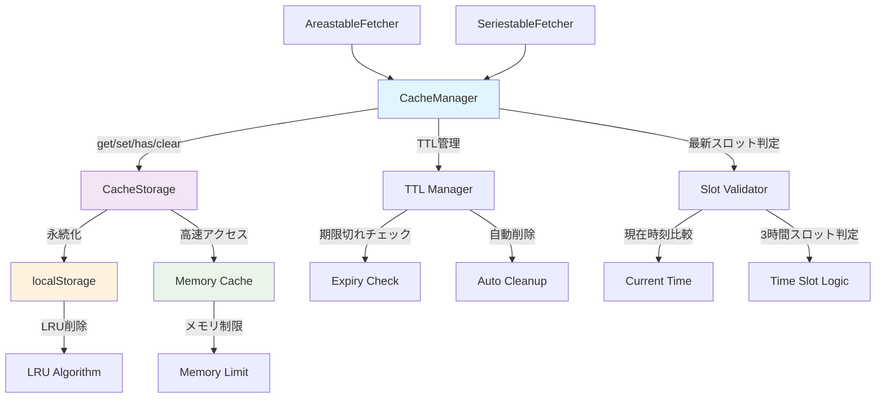

# JSONキャッシュ機能実装仕様

## 概要

Enhance JMA Amedas userscriptにおいて、気象庁APIから取得するJSONデータの効率的なキャッシュ機能を実装する。現在のメモリ内キャッシュから、永続化と有効期限管理を備えた統一キャッシュシステムに移行する。

## 現状分析

### キャッシュ対象API

1. **エリアテーブル用マップデータ**
   - URL: `https://www.jma.go.jp/bosai/amedas/data/map/{yyyymmddhhmmss}.json`
   - 特徴: 全観測所の特定時刻データを一括取得
   - 更新頻度: 10分間隔

2. **時系列テーブル用ポイントデータ**
   - URL: `https://www.jma.go.jp/bosai/amedas/data/point/{code}/{yyyymmdd}_{hh}.json`
   - 特徴: 特定観測所の3時間単位データ（内部は10分間隔データ）
   - 更新頻度: **最新3時間スロットのみ10分間隔**、過去スロットは更新されない

### 現在の問題点

- **メモリ内キャッシュのみ**: ページリロードで全て消失
- **有効期限なし**: 古いデータが残り続ける
- **重複実装**: AreastableFetcher/SeriestableFetcherで同じMap方式
- **統一性の欠如**: 各Fetcherが独立したキャッシュ戦略

## 新キャッシュシステム設計

### アーキテクチャ



### キャッシュキー設計

```typescript
interface CacheKey {
  type: 'map' | 'point'
  url: string
  timestamp?: string
}
```

**キー生成例:**

- マップデータ: `enhanced_jma:map:20250726180000`
- ポイントデータ: `enhanced_jma:point:44132:20250726_18`

### TTL（有効期限）戦略

| データ種別 | TTL | 理由 |
|-----------|-----|------|
| マップデータ | 1時間 | アメダス更新間隔に合わせる |
| ポイントデータ（最新スロット） | 0 | 最新スロットは10分間隔で更新される |
| ポイントデータ（過去スロット） | 3日 | 過去データは更新されないため無期限キャッシュ可能 |

### 容量管理

- **localStorage上限**: 5MB（一般的ブラウザ制限）
- **削除方式**: LRU（Least Recently Used）
- **クリーンアップ**: 起動時 + 容量不足時の自動実行

## 実装計画

### Phase 1: コアシステム構築

1. **cache_types.ts** - 型定義

   ```typescript
   interface CacheEntry<T> {
     data: T
     timestamp: number
     ttl: number
     accessCount: number
   }
   ```

2. **cache_storage.ts** - 永続化レイヤー
   - localStorage読み書き
   - エラーハンドリング
   - 容量制限管理

3. **cache_manager.ts** - 統一マネージャー
   - get/set/has/clear API
   - TTL有効期限チェック
   - 最新スロット判定機能（ポイントデータ用）
   - LRU削除機能

### Phase 2: 既存システム統合

4. **Fetcherクラス修正**
   - Map → CacheManager移行
   - 既存APIの互換性維持

5. **テスト修正**
   - localStorage mockの統一
   - 既存テストケースの保護

### Phase 3: 品質保証

6. **単体テスト**
   - 各レイヤーの独立テスト
   - エッジケースカバレッジ

7. **統合テスト**
   - 実際のAmedasFetcher動作確認
   - パフォーマンス測定

## ファイル構成

```
src/jma/cache/
├── cache_types.ts          # 型定義・インターフェース
├── cache_storage.ts        # localStorage永続化レイヤー
├── cache_manager.ts        # 統一キャッシュマネージャー
├── cache_manager.test.ts   # CacheManager単体テスト
└── cache_storage.test.ts   # CacheStorage単体テスト
```

## 移行戦略

### 段階的移行

1. **新システム並行稼働**: 既存Mapキャッシュを残したまま新システム構築
2. **Fetcherクラス修正**: 一つずつ新システムに移行
3. **旧システム削除**: 移行完了後に旧Map実装を削除

### 後方互換性

- 既存AmedasFetcher APIは変更なし
- テストケースへの影響最小化
- LocalStorage使用パターン（カラースケール設定）との共存

## 期待効果

### パフォーマンス向上

- **ページリロード時間短縮**: 永続キャッシュによる再取得回避
- **ネットワーク負荷軽減**: 重複リクエストの削減
- **レスポンス時間改善**: メモリ+ストレージ2層キャッシュ

### 運用性向上

- **統一管理**: 散在していたキャッシュロジックの一元化
- **デバッグ性**: キャッシュ状態の可視化・制御
- **保守性**: モジュラー設計による変更容易性

## 実装上の注意点

### セキュリティ

- XSS対策: キャッシュデータのサニタイズ

### エラーハンドリング

- localStorage無効時のフォールバック（メモリのみ）
- 容量不足時の自動クリーンアップ
- データ破損時の自動復旧

### ブラウザ互換性

- localStorage対応状況チェック
- Safari private modeでの制限対応
- 古いブラウザでのgraceful degradation

## 今後の拡張性

### 機能拡張

- キャッシュ統計・分析機能
- ユーザー設定によるキャッシュON/OFF
- 手動キャッシュクリア機能

### API拡張

- キャッシュウォームアップ（事前ロード）
- 圧縮・暗号化オプション
- 同期処理対応（if needed）
