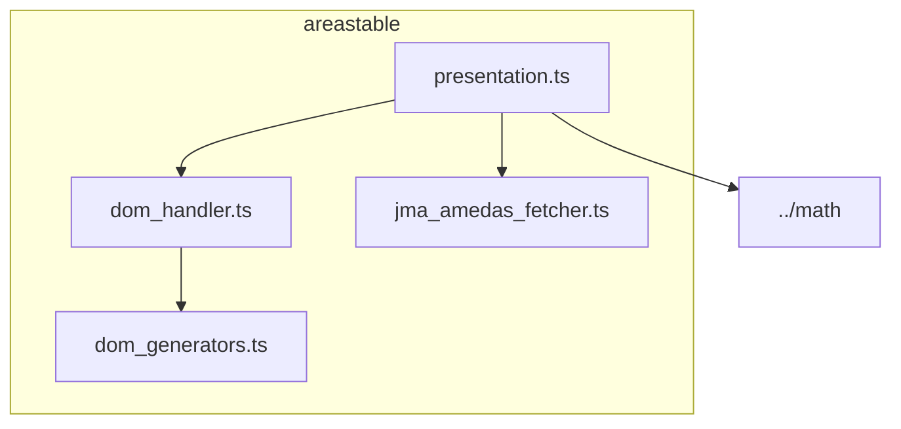

# areastable ディレクトリ概要

このディレクトリは、気象庁アメダスデータの「地域表（areastable）」の DOM 生成・操作・データ変換を担うモジュール群です。

## 主なファイルと役割

- `dom_generators.ts`  
  表の各種 DOM 要素生成関数を提供します（DOM の直接操作はしません）。
- `dom_handler.ts`  
  areastable の DOM 検索・列追加など、DOM 操作のロジックをまとめています。`dom_generators.ts` の関数を利用します。
- `jma_amedas_fetcher.ts`  
  アメダスデータの URL 生成・データ変換・取得ロジックを提供します。
- `presentation.ts`  
  アメダスデータから areastable 用の行データ（例：容積絶対湿度、露点温度）を生成します。`jma_amedas_fetcher.ts` の型や `../math` の計算クラスを利用します。

---

## 依存関係図（Mermaid）

---

### 補足

- `presentation.ts` は `dom_handler.ts` の型（AreastableRow）や `jma_amedas_fetcher.ts` の型（AmedasData）を参照します。
- `dom_handler.ts` は `dom_generators.ts` の DOM 生成関数を利用します。
- `jma_amedas_fetcher.ts` はデータ取得・変換のロジックを提供し、`presentation.ts` で利用されます。
