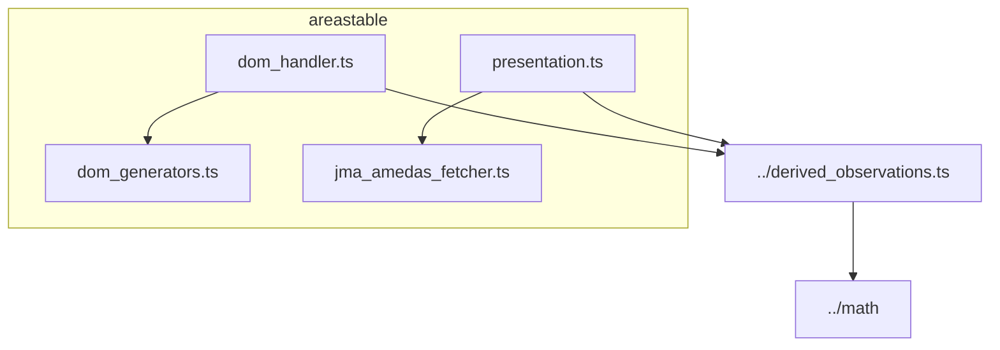

# areastable ディレクトリ概要

このディレクトリは、気象庁アメダスデータの「地域表（areastable）」の DOM 生成・操作・データ変換を担うモジュール群です。

## 主なファイルと役割

- `areastable_main.ts`  
  表に表示されている観測時刻のデータで派生列を生成し、表・地点行の再生成や時刻見出しの変更に追従します。`#amd-table` と内部の表が一括挿入された場合にも初期描画を行います。
- `observation_time.ts`  
  日本語・英語の地域表見出しから観測時刻をJSTとして読み取ります。時刻を判読できない場合は、最新時刻で代用せず派生値を欠測表示します。
- `../auto_refresh.ts`  
  時系列表と共通の自動更新処理です。地域表の最新観測時刻を確認し、更新がある場合はページ全体を再読み込みして標準値と派生値を同じ時刻にそろえます。
- `dom_generators.ts`  
  表の各種 DOM 要素生成関数を提供します（DOM の直接操作はしません）。
- `dom_handler.ts`  
  areastable の DOM 検索・列追加など、DOM 操作のロジックをまとめています。`dom_generators.ts` の関数を利用します。
- `jma_amedas_fetcher.ts`  
  アメダスデータの URL 生成・データ変換・取得ロジックを提供します。取得日時は実時刻の `Date` として受け取り、共有の `jstDateToTimestamp()` でJSTのファイル名へ変換します。端末のタイムゾーンに依存せず、日付・月・年の境界でも同じ観測時刻のデータを取得します。
- `presentation.ts`  
  地点行の順序で観測データを取り出し、`../derived_observations.ts` の共通処理で派生値の3列を生成します。時系列表と同じ欠損判定、小数1桁の表示、指標定義を使用します。

## 更新の動作

- 地域表は操作不要で常時自動更新します。2分間隔の定期確認に加え、初期表示時と地域切替時にも最新時刻を確認します。
- 表示中の観測時刻より新しいデータが公開されていれば、現在のURLでページ全体を再読み込みします。
- 非表示のタブでは確認を停止し、再表示時に確認を再開します。グラフや過去日時を指定した画面は更新対象外です。
- 時刻が同じ場合や最新時刻の取得に失敗した場合は、現在の表を維持します。

---

## 依存関係図（Mermaid）

```mermaid
graph TD
  subgraph areastable
    dom_generators["dom_generators.ts"]
    dom_handler["dom_handler.ts"]
    jma_amedas_fetcher["jma_amedas_fetcher.ts"]
    presentation["presentation.ts"]
  end

  dom_handler --> dom_generators
  presentation --> derived_observations["../derived_observations.ts"]
  presentation --> jma_amedas_fetcher
  dom_handler --> derived_observations
  derived_observations --> math["../math"]
```

---

### 補足

- `presentation.ts` は共有の列型（DerivedObservationColumns）と `jma_amedas_fetcher.ts` の観測データ型（AmedasData）を参照します。`dom_handler.ts` も共有の列型（DerivedObservationColumn）を受け取ります。
- `dom_handler.ts` は `dom_generators.ts` の DOM 生成関数を利用します。
- `jma_amedas_fetcher.ts` はデータ取得・変換のロジックを提供し、`presentation.ts` で利用されます。
