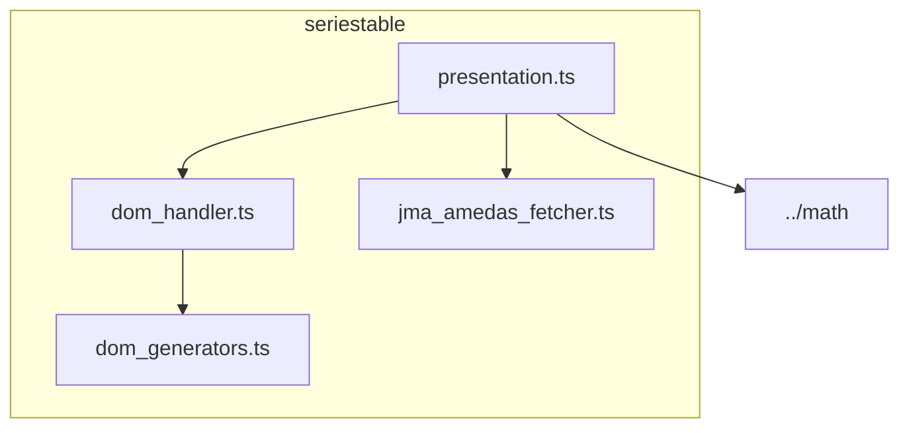

# seriestable ディレクトリ概要

このディレクトリは、気象庁アメダスデータの「時系列表（seriestable）」の DOM 生成・操作・データ変換を担うモジュール群です。

## 主なファイルと役割

- `seriestable_main.ts`  
  初期化時にすでに存在する表示中の時系列表へ派生列を追加し、その後の表の再生成も監視します。`#amd-table` と内部の表が一括挿入された場合にも初期描画を行います。
- `observation_time.ts`  
  日本語・英語の時系列表の最新行をJSTとして読み取ります。年・月は最新公開時刻を基準に補い、月・年またぎや前日24:00の表記にも対応します。
- `../auto_refresh.ts`  
  地域表と共通の自動更新処理です。表示形式に応じた新しい観測データが公開されたときにページ全体を再読み込みします。
- `dom_generators.ts`  
  表の各種 DOM 要素生成関数を提供します（DOM の直接操作はしません）。
- `dom_handler.ts`  
  seriestable の DOM 検索・列追加など、DOM 操作のロジックをまとめています。日本語・英語の日付セルから時系列を取得し、`dom_generators.ts` の関数で列を追加します。
- `jma_amedas_fetcher.ts`  
  アメダスデータの URL 生成・データ変換・取得ロジックを提供します。
- `presentation.ts`  
  アメダスデータから seriestable 用の行データ（例：容積絶対湿度、露点温度）を生成します。`jma_amedas_fetcher.ts` の型や `../math` の計算クラスを利用します。

## 更新の動作

- 時系列表は操作不要で常時自動更新します。2分間隔の定期確認に加え、初期表示時と地点・表示形式の切替時にも最新時刻を確認します。
- 10分表では最新行より新しい10分データ、1時間表では次の正時データが公開されたときに、現在のURLでページ全体を再読み込みします。1時間表は同じ時間内の10分更新では再読み込みしません。
- 過去日時を指定した画面は更新対象外です。非表示のタブでは確認を停止し、再表示時に確認を再開します。
- 最新時刻が同じ場合や取得に失敗した場合は、現在の表を維持します。

---

## 依存関係図（Mermaid）

---

### 補足

- `presentation.ts` は `dom_handler.ts` の型（SeriestableRow）や `jma_amedas_fetcher.ts` の型（AmedasData）を参照します。
- `dom_handler.ts` は `dom_generators.ts` の DOM 生成関数を利用します。
- `jma_amedas_fetcher.ts` はデータ取得・変換のロジックを提供し、`presentation.ts` で利用されます。
